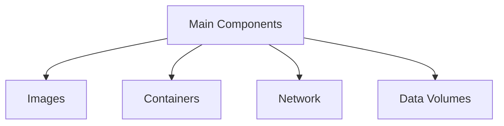
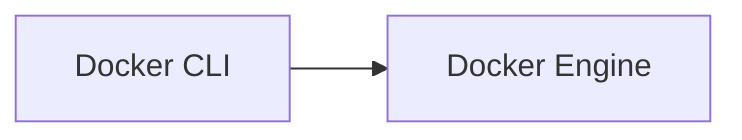

# :flashlight: Docker Roadmap for Codinto

### :crystal_ball: Introduction

1. #### What are containers?

- Containers are lightweight, portable, and isolated software environments that allow developers to run and package applications with their dependencies, consistently across different platforms. They help to streamline application development, deployment, and management processes while ensuring that applications run consistently, regardless of the underlying infrastructure.

2. #### Linux Fundamentals

- Shell commands

- Shell scripting

---

### :satellite: Underlying Technologies

- Linux Containers (LXC)

- Control Groups (cgroups)

- Union File Systems (UnionFS)

- Namespaces

---

### :whale: Docker Basics

1. #### Docker Components

- Dockerfile

- Docker Image

- Docker Container

2. #### Docker Commands

- `docker pull <image>`: Download an image from a registry, like Docker Hub.
- `docker build -t <image_name> <path>`: Build an image from a Dockerfile, where <path> is the directory containing the Dockerfile.
- `docker image ls`: List all images available on your local machine.
- `docker run -d -p <host_port>:<container_port> --name <container_name> <image>`: Run a container from an image, mapping host ports to container ports.
- `docker container ls`: List all running containers.
- `docker container stop <container>`: Stop a running container.
- `docker container rm <container>`: Remove a stopped container.
- `docker image rm <image>`: Remove an image from your local machine.

---

### :floppy_disk: Data Persistence Methods

1. #### What is Ephemeral FS

- <details>
    By default, the storage within a Docker container is ephemeral, meaning that any data changes or modifications made inside a container will only persist as long as the container is running. Once the container is stopped and removed, all the associated data will be lost. This is because Docker containers are designed to be stateless by nature.
    This temporary or short-lived storage is called the “ephemeral container file system”. It is an essential feature of Docker, as it enables fast and consistent deployment of applications across different environments without worrying about the state of a container.
  </details>

2. #### Volumes

- A Docker managed storage option, stored outside the container’s FS, allowing data to be persisted across container restarts and removals.

3. #### Bind mounts

- Mapping a host machine’s directory or file into a container, effectively sharing host’s storage with the container.

4. #### tmpfs mounts

- In-memory storage, useful for cases where just the persistence of data within the life-cycle of the container is required.

---

### :globe_with_meridians: Using 3rd Party Container Images

1. #### Docker Hub

- Is the largest and most popular container image registry containing both official and community-maintained images.

2. #### Using in Dockerfile

- Set base image using `FROM` directive like this: `FROM node:14`

3. #### Find a remote image and run container of it

- `docker search mongo`: search for official image
- `docker pull mongo`: pull the image
- `docker run --name some-mogo -p 27017:27017 -d mongo`: run a MongoDB container

4. #### Interactive Test Environments

- Docker allows you to create isolated, disposable environments that can be deleted once you’re done with testing. This makes it much easier to work with third party software, test different dependencies or versions, and quickly experiment without the risk of damaging your local setup.
- Some example:
  - `docker run -it --rm python`
  - `docker run -it --rm node`
  - `docker run -it --rm --name temp-mysql -e MYSQL_ALLOW_EMPTY_PASSWORD=yes -p 3306:3306 mysql`

5. #### Command Line Utilities

- Using third-party Docker images for command line utilities can save time, simplify your development setup, and help ensure a consistent environment across different machines.

- ##### BusyBox

  - **BusyBox** is a small (1-2 Mb) and simple command line application that provides a large number of the commonly used Unix utilities, such as awk, grep, vi, etc.
  - Usage:
    - `docker pull busybox`
    - `docker run -it busybox /bin/sh`

- ##### cURL

  - cURL is a well-known command line tool that can be used to transfer data using various network protocols. It is often used for testing APIs or downloading files from the internet.
  - Usage:
    - `docker pull curlimages/curl`
    - `docker run --rm curlimages/curl https://example.com`

- ##### wget

  - A free utility for non-interactive download of files from the Web.

- ##### imagemagick

  - A powerful software suite for image manipulation and conversion.

- ##### jq

  - A lightweight and flexible command-line JSON processor.

---

### :cyclone: Building Container Images

1. #### Dockerfile

- A Dockerfile is a text document that contains a list of instructions used by the Docker engine to build an image.
- Each instruction in the Dockerfile adds a new layer to the image.
- Docker will build the image based on these instructions, and then you can run containers from the image. Dockerfiles are one of the main elements of infrastructure as code.

- ##### Structure of a Dockerfile

  - A Dockerfile is organized in a series of instructions, one per line. Each instruction has a specific format: `INSTRUCTION arguments`

  - Simple Dockerfile example:

```Dockerfile
# Use an official Python runtime as a parent image
FROM python:3.7-slim

# Set the working directory to /app
WORKDIR /app

# Copy the current directory contents into the container at /app
COPY . /app

# Install any needed packages specified in requirements.txt
RUN pip install --trusted-host pypi.python.org -r requirements.txt

# Make port 80 available to the world outside this container
EXPOSE 80

# Define environment variable
ENV NAME World

# Run app.py when the container launches
CMD ["python", "app.py"]
```

- ##### Common Dockerfile instructions

  - `FROM`: Sets the base image to begin with. It is mandatory to have FROM as the first instruction in the Dockerfile.
  - `WORKDIR`: Sets the working directory for any `RUN`,`CMD` , `ENTRYPOINT`, `COPY` or `ADD` instructions. If the directory does not exist, it will be created automatically.
  - `COPY`: Copies files or directories from the host into the container’s file system.
  - `ADD`: Similar to COPY, but can also handle remote URLs and automatically unpack archives.
  - `RUN`: Executes a command within the image as a new layer.
  - `CMD`: Defines the default command to execute when running a container from the image.
  - `ENTRYPOINT`: Similar to `CMD`, but it’s designed to allow a container as an executable with its own parameters.
  - `EXPOSE`: Informs Docker that the container will listen on the specified network ports at runtime.
  - `ENV`: Sets environment variables for the container.

- ##### Building an Image from a Dockerfile

- `docker build -t my-image:tag .`

2. #### Efficient Layer Caching

- When building container images, Docker caches the newly created layers. These layers can then be used later on when building other images, reducing the build time and minimizing bandwidth usage.

<details>
  <summary>Some tips for efficient caching</summary>

- Minimize changes in the Dockerfile: Try to minimize the frequency of changes in your Dockerfile, and structure your instructions in a way that most frequently changed lines appear at the bottom.

- Build context optimization: Use .dockerignore file to exclude unnecessary files from the build context that might cause cache invalidation.

- Use smaller base images: Smaller base images reduce the time taken to pull the base image as well as the number of layers that need to be cached.

- Leverage the Docker’s --cache-from flag: If you’re using a CI/CD pipeline, you can specify which image to use as a cache source.

- Combine multiple instructions: In some cases, combining instructions (e.g., RUN) can help minimize the number of layers, making caching more efficient.

</details>

3. #### Image Size and Security

<details>

- When building container images, it’s essential to be aware of both image size and security. The size of the image affects the speed at which your containers are built and deployed. Smaller images lead to faster builds and reduced network overhead when downloading the image. Security is crucial because container images can contain vulnerabilities that could potentially put your applications at risk.

</details>

##### Reducing Image Size Tips

- <details>
        <summary>Use an appropriate base image</summary>
    Choose a smaller, more lightweight base image that includes only the necessary components for your application. For example, consider using the alpine variant of an official image, if available, as it’s typically much smaller in size.

```dockerfile
FROM node:14-alpine
```

  </details>

- <details>
      <summary>Run multiple commands in a single `RUN` statement</summary>
  Each RUN statement creates a new layer in the image, which contributes to the image size. Combine multiple commands into a single RUN statement using && to minimize the number of layers and reduce the final image size.

```dockerfile
RUN apt-get update && \
      apt-get install -y some-required-package
```

  </details>

- <details>
     <summary>Remove unnecessary files in the same layer</summary>
  When you install packages or add files during the image build process, remove temporary or unused files in the same layer to reduce the final image size.

```dockerfile
RUN apt-get update && \
    apt-get install -y some-required-package && \
    apt-get clean && \
    rm -rf /var/lib/apt/lists/*
```

  </details>

- <details>
     <summary>Use multi-stage builds</summary>
  Use multi-stage builds to create smaller images. Multi-stage builds allow you to use multiple FROM statements in your Dockerfile. Each FROM statement creates a new stage in the build process. You can copy files from one stage to another using the COPY --from statement

```dockerfile
FROM node:14-alpine AS build
WORKDIR /app
COPY package*.json ./
RUN npm install
COPY . .
RUN npm run build
FROM node:14-alpine
WORKDIR /app
COPY --from=build /app/dist ./dist
COPY package*.json ./
RUN npm install --production
CMD ["npm", "start"]
```

  </details>

- <details>
       <summary>Use .dockerignore file</summary>
    Use a .dockerignore file to exclude unnecessary files from the build context that might cause cache invalidation and increase the final image size.
  `node_modules
  npm-debug.log`
  </details>

---

## :milky_way: Some Visualization of Docker Concepts

### Main Components of Docker



---

### Docker Client vs Docker Engine



Adding some new as soon...
Be patient:heart:
